# fully-automatic-hand-pose-estimation

Pytorch implementation of ***Fully-Automatic-Hand-Pose-Estimation*** which estimate hand pose with multi view automatically.<br>
There are so many papers to get pose annotation without manual method. Those are datasets, and we can use those datasets to raise
performance. You can see link related to make datasets in below. <br>

## Prerequisites
- Linux or macOS
- python3+

## Installation
```bash
git clone https://github.com/CY-Jeong/fully-automatic-hand-pose-estimation.git
cd fully-automatic-hand-pose-estimation
```
- Pip users, ```pip install -r requirements.txt```
- Conda users, ```conda env create -f environment.yml```

## Usage
First you need to get intrinsic, extrinsic files from **[calibration](https://github.com/CY-Jeong/camera-calibration)** which make calibration files with multiview.
If you do calibration, you can have calibration information.
And you must get **[MANO parameter pkl file](https://mano.is.tue.mpg.de/)** and **[CPM pretrained pose parameter](https://github.com/lmb-freiburg/hand3d)**.
So your final directory should be 
```
Calibration/
  result_dir/
    intrinsic.json
    extrinsic.json
fully-automatic-hand-pose-estimation/
  data/
    MANO_RIGHT.pkl
    MANO_LEFT.pkl
    posenet3d-rhd-stb-slr-finetuned.pickle
  optimize.py
```

To optimize a model
```python optimize.py```


## Results
### Segmentation with grabcut, no training with annotation
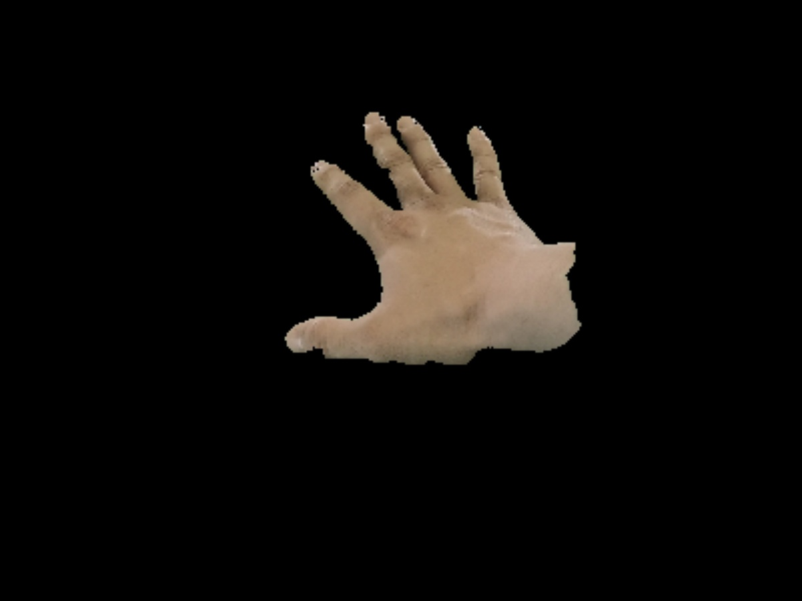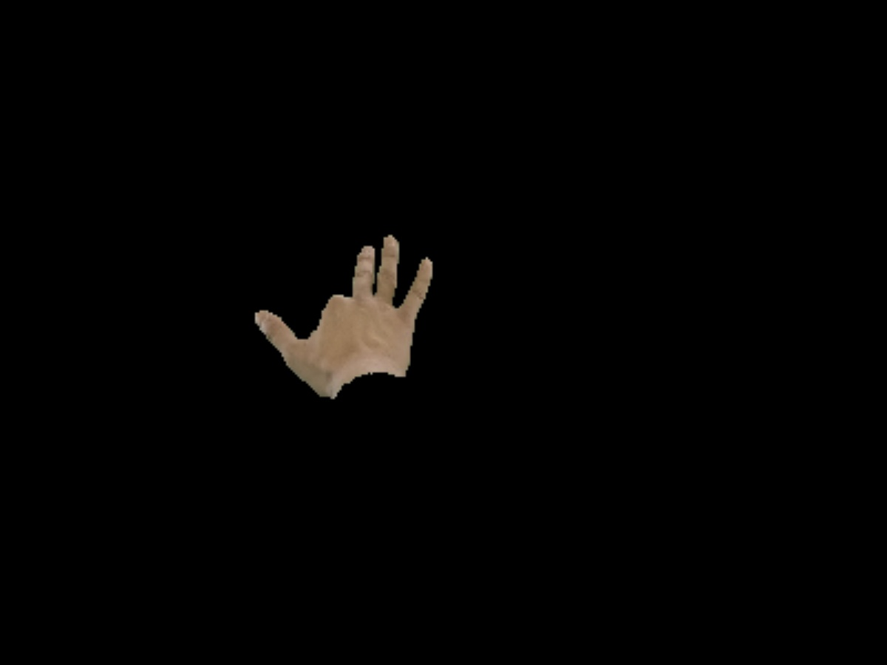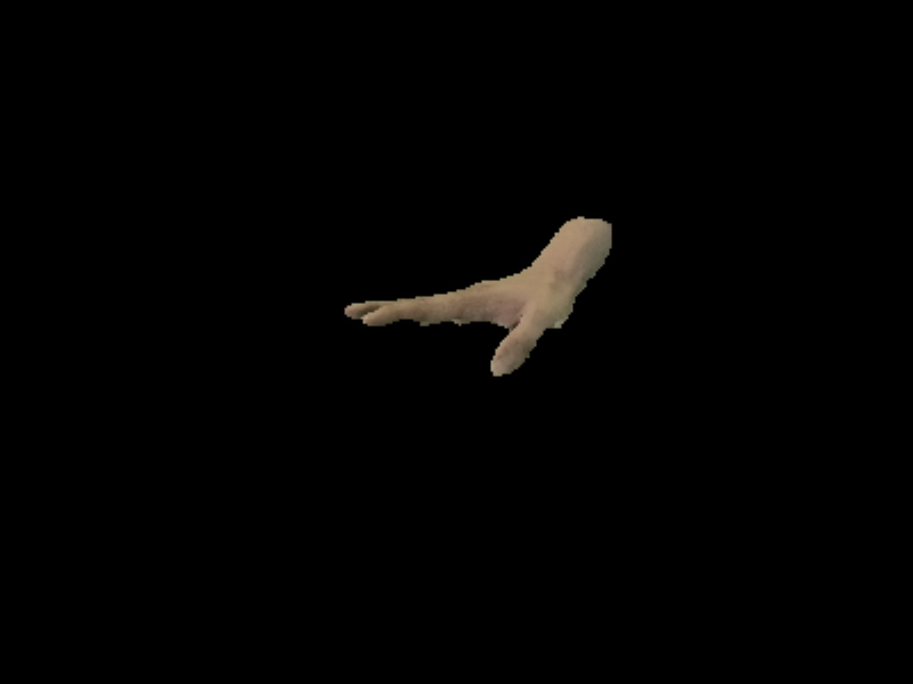

### Improving pose with multi view in first frame
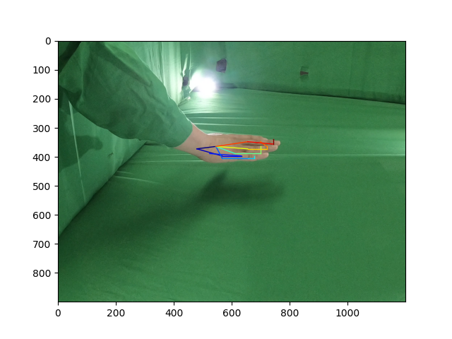              <br>
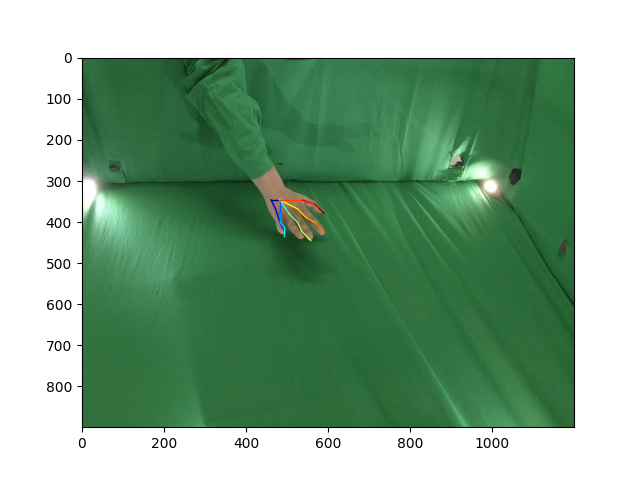              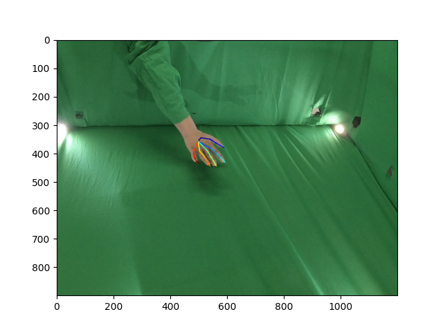

### Optimizing pose with multi view segmentation after first frame
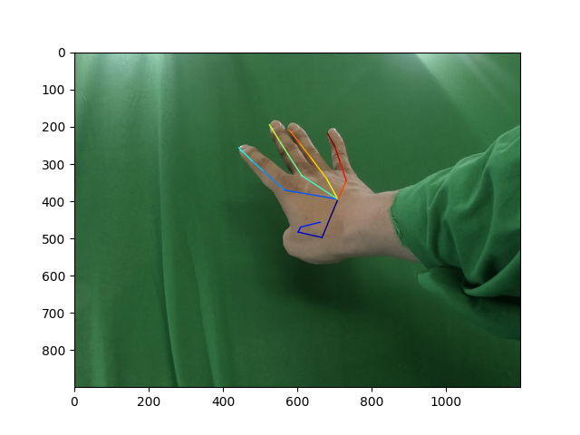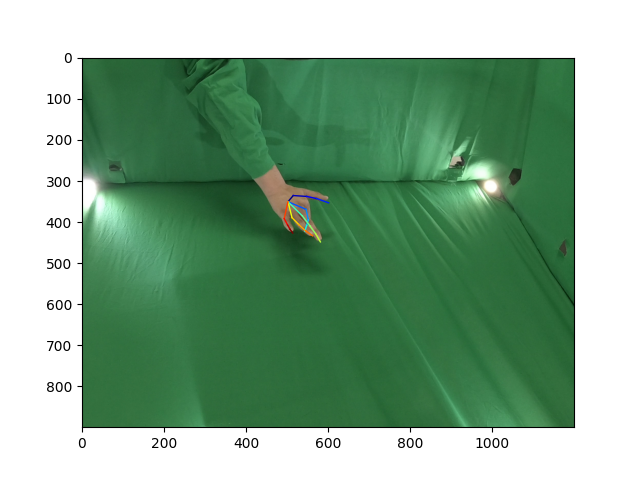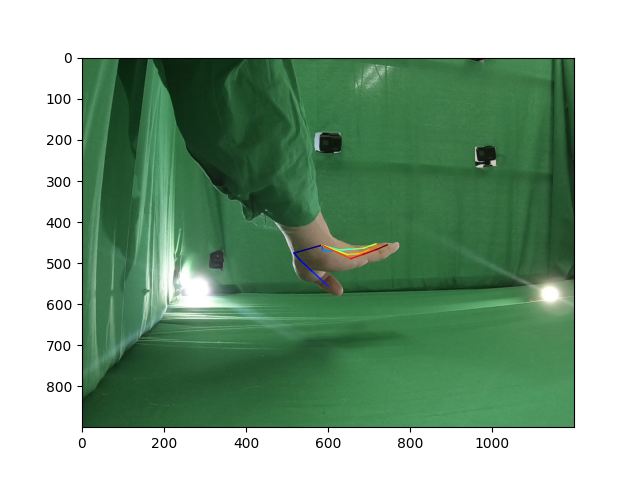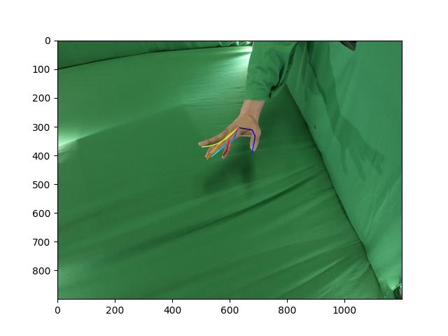

### Synthesizing background
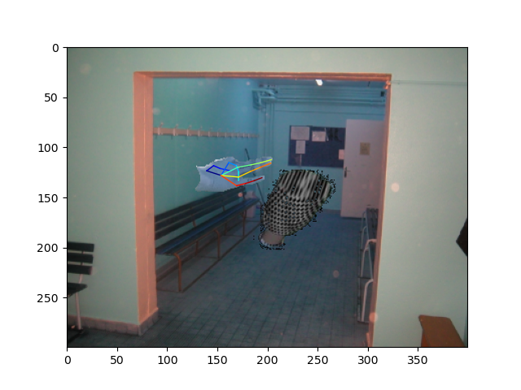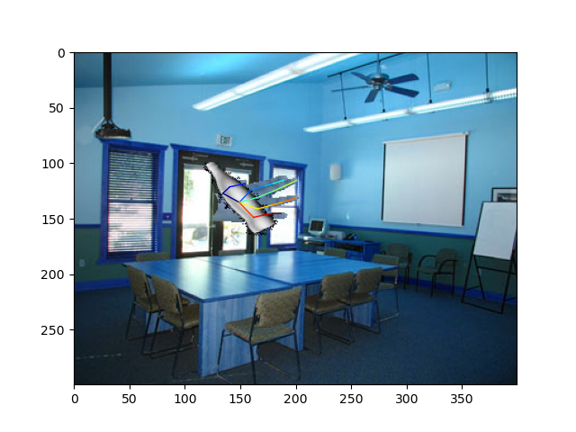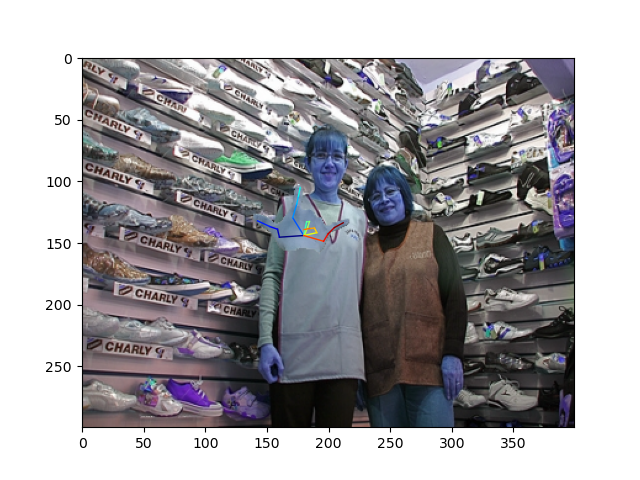
